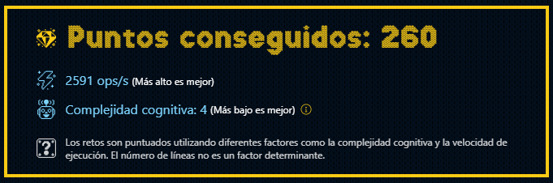

# Reto #2: Ponemos en marcha la fábrica

Nivel de dificultad: **`Fácil`**

Ejecutar test de prueba: **`npm run test_day02`**

## Instrucciones

En el taller de Santa, los elfos tienen una **lista de regalos** que desean fabricar y un conjunto limitado de materiales.

Los *regalos son cadenas de texto* y los *materiales son caracteres*. Tu tarea es escribir una función que, dada una lista de regalos y los materiales disponibles, devuelva una **lista de los regalos que se pueden fabricar**.

Un regalo se puede fabricar si contamos con todos los materiales necesarios para fabricarlo.

``` javascript
const gifts = ['tren', 'oso', 'pelota']
const materials = 'tronesa'

manufacture(gifts, materials) // ["tren", "oso"]
// 'tren' SÍ porque sus letras están en 'tronesa'
// 'oso' SÍ porque sus letras están en 'tronesa'
// 'pelota' NO porque sus letras NO están en 'tronesa'

const gifts = ['juego', 'puzzle']
const materials = 'jlepuz'

manufacture(gifts, materials) // ["puzzle"]

const gifts = ['libro', 'ps5']
const materials = 'psli'

manufacture(gifts, materials) // []
```

## Resultados

Archivo `day02.js`:


